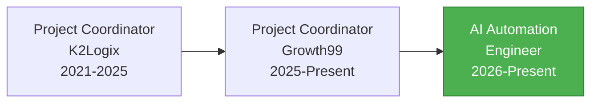

# Hi there, I'm Rayees Yousuf 👋

### AI Automation Engineer | Project Manager | Workflow Architect

**Transforming 5+ years of project management & operations expertise into intelligent automation solutions**

I build AI-powered automation workflows that eliminate repetitive tasks and streamline business operations using **n8n**, **AI agents**, and **no-code platforms**.

📍 Remote — India | 📧 rayeesyousuf80@gmail.com | 📱 +91 70069 82491

---

## 🚀 About Me

- 🔭 **Currently:** Building AI automation agents for hiring, customer support, and business workflows
- 💼 **Background:** 5+ years as Project Manager/Coordinator at Growth99 & K2Logix
- 🌱 **Specializing in:** n8n workflow automation, WhatsApp integrations, rule-based AI systems
- 💡 **Mission:** Creating cost-effective automation solutions without expensive AI APIs
- 🎯 **Focus:** Bridging project management expertise with AI automation capabilities
- 🏆 **Certified in:** Jira PM, AI Tools, ChatGPT Expert, Customer Service, Digital Marketing

---

## 💼 Professional Journey



**From Project Management to AI Automation:**
- ✅ Managed 100+ client projects across WordPress, Shopify, and ecommerce platforms
- ✅ Coordinated cross-functional teams (Dev, SEO, Design, QA, Infrastructure)
- ✅ Streamlined operations through SOP standardization and workflow optimization
- ✅ Now building AI agents that automate the very workflows I used to manage manually

---

## 🛠️ Tech Stack

### AI & Automation


### Project Management & Collaboration


### Ecommerce & CMS


### Analytics & SEO


### Development & APIs


### Databases & Integration


---

## 📌 Featured Projects

### 🤖 [WhatsApp Hiring Assistant](https://github.com/RayeesYousufGenAi/whatsapp-hiring-assistant)
**Intelligent WhatsApp bot for automated candidate screening and job matching**

Built for Catalyst Hiring Solutions to automate the entire candidate screening workflow.

**Features:**
- ✅ Rule-based AI classification (NO paid APIs)
- ✅ Automatic work preference detection (WFH/WFO)
- ✅ Job keyword matching and routing
- ✅ Google Sheets integration for candidate database
- ✅ Automated job details delivery
- ✅ Clarifying questions for unclear inputs

**Tech Stack:** n8n, WhatsApp Business API, Google Sheets, JavaScript, Rule-Based Logic

**Impact:** Eliminates manual screening, saves hours daily, zero API costs

---

## 🎯 Core Expertise

### AI Automation & Workflows
```javascript
const expertise = {
  automation: {
    platform: "n8n",
    specialization: ["Workflow Design", "AI Agents", "Integration"],
    approach: "Cost-effective, rule-based solutions"
  },
  aiTools: ["ChatGPT", "Claude AI", "Google Gemini", "Perplexity"],
  integrations: ["WhatsApp API", "Google Sheets", "CRM Systems", "Payment Gateways"],
  focus: "Building intelligent automation that replaces manual workflows"
};
```

### Project & Operations Management
- 📊 **Project Coordination** - 5+ years managing digital service delivery
- 🎫 **Ticket Management** - Zoho Desk, Zendesk, Intercom, SLA tracking
- 👥 **Cross-Functional Teams** - Dev, SEO, Design, QA, Infrastructure
- 📝 **SOP Development** - Workflow standardization and documentation
- 🔄 **Process Optimization** - Streamlining operations and reducing bottlenecks

### Ecommerce & Digital Operations
- 🛒 **Shopify Admin** - Product management, orders, inventory, apps
- 🌐 **WordPress Operations** - Site management, maintenance, support
- 💳 **Payment Integration** - Razorpay, Stripe, PayPal configuration
- 📈 **SEO & Analytics** - GA4, Search Console, Tag Manager
- 🚀 **Launch Coordination** - UAT, QA, go-live, post-launch support

---

## 📊 GitHub Stats

<div align="center">
  
  
</div>

<div align="center">
  
</div>

---

## 🏆 Certifications

- 🎓 **Jira Project Management** — Great Learning
- 🤖 **AI Tools & ChatGPT Expert** — Be10x
- 📝 **AI Prompt Engineering & Productivity** — Certified
- 👥 **Certified Customer Service Specialist (CSS)** — NSDC
- 📊 **Customer Experience (CX) Foundations** — LinkedIn Learning
- 🌐 **Fundamentals of Digital Marketing** — Google Digital Garage

---

## 💡 What I Bring to the Table

### Unique Combination
**Project Management Experience + AI Automation Skills = Powerful Solutions**

I understand the pain points of manual project coordination because I've lived them for 5+ years. Now I'm building AI agents that solve these exact problems.

### Real-World Problem Solving
- ✅ Automated candidate screening (WhatsApp Hiring Assistant)
- ✅ Workflow automation for repetitive tasks
- ✅ Integration of multiple tools and platforms
- ✅ Cost-effective solutions (no expensive AI APIs)
- ✅ Scalable, maintainable architectures

### Technical + Business Mindset
- 🎯 Understand business requirements from PM perspective
- 🔧 Build technical solutions with automation tools
- 📊 Track metrics and optimize for efficiency
- 📝 Document processes and create SOPs
- 🤝 Communicate effectively with stakeholders

---

## 🌟 Current Focus

- 🤖 Building AI automation agents for business workflows
- 📱 WhatsApp integration and chatbot development
- 🔄 Creating reusable n8n workflow templates
- 💰 Developing cost-effective alternatives to paid AI services
- 📚 Sharing knowledge through open-source projects
- 🎓 Continuous learning in AI and automation

---

## 📈 Professional Timeline

**2026 - Present:** AI Automation Engineer
- Building intelligent automation workflows
- Creating AI agents for hiring, support, and operations

**May 2025 - Present:** Project Coordinator @ Growth99
- Coordinating service delivery across multiple teams
- Managing SLA compliance and client workflows

**Mar 2021 - Apr 2025:** Project Coordinator @ K2Logix
- Managed 100+ Shopify and WordPress projects
- Streamlined operations through SOP standardization

---

## 🛠️ Tools I Work With Daily

**Project Management:** Jira • ClickUp • Asana • Monday.com • Notion • Trello • Basecamp • Smartsheet

**Automation:** n8n • Zapier • Make (Integromat)

**AI Tools:** ChatGPT • Claude AI • Google Gemini • Perplexity • Gamma.app

**Communication:** Slack • Microsoft Teams • Zoom • Google Meet • Loom

**Analytics:** Google Analytics (GA4) • Search Console • Tag Manager

**Platforms:** Shopify • WordPress • WooCommerce • Wix

**Hosting:** Hostinger • GoDaddy • Namecheap • Cloudflare

---

## 🌍 Languages

🇬🇧 English | 🇮🇳 Hindi | 🇵🇰 Urdu | Kashmiri

---

## 🤝 Let's Connect!

<div align="center">

[](mailto:rayeesyousuf80@gmail.com)
[](https://wa.me/917006982491)
[](https://linkedin.com/in/rayees-yousuf)
[](https://github.com/RayeesYousufGenAi)

</div>

---

## 💭 Philosophy

> **"The best automation is the one that solves real problems without breaking the bank."**

I believe in:
- 🎯 **Practical solutions** over complex architectures
- 💰 **Cost-effectiveness** over expensive tools
- 📚 **Knowledge sharing** over gatekeeping
- 🔄 **Continuous improvement** over perfection
- 🤝 **Collaboration** over competition

---

## 📊 Activity


---

<div align="center">

### ⭐ Star my repositories if you find them useful!

**"From managing workflows to automating them — one intelligent agent at a time"** 🚀

</div>

---

## 📝 Recent Activity

<!--START_SECTION:activity-->
<!--END_SECTION:activity-->

---

<div align="center">
  
</div>
